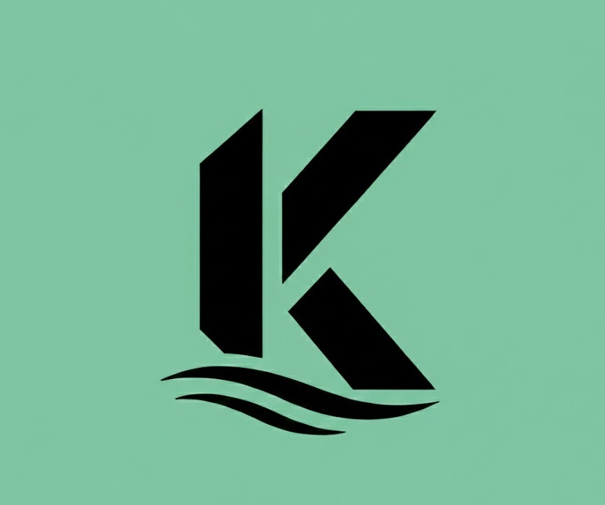

# Kalship 

Create your own agentic prediction feed on top of Kalshi

Agentic market matching that links YouTube Shorts to relevant Kalshi markets, with live YES/NO context and optional AI video generation.

## Features
| Feature | Description |
| --- | --- |
| Shorts-to-Market Matching | Uses OpenAI + YouTube metadata to match each short to relevant Kalshi markets |
| Multi-Market Bet Panel | Surfaces matched markets with YES/NO prices and quick selection |
| Historical Price Charts | Pulls Kalshi candlesticks and renders interactive price history |
| Guided Betting Overlay | Includes a tutorial flow, 3D character coach, and external-bet warning |
| Injected Visualization Reels | After a YES/NO action, themed MP4 clips are inserted into the feed |
| Async Video Job Pipeline | Backend supports Gemini + Veo generation with Cloud Storage + Cloud Tasks |

## Architecture (Local)
- **Frontend (Next.js):** Reel UI, market panel, charts, tutorial, and job-status polling.
- **Backend API (BlackSheep):** Shorts-to-market matching, candlesticks, advice, job create/status.
- **Worker:** Processes async video-generation jobs.
- **GCP Services:** Cloud Tasks for queueing, Cloud Storage for generated media.

## Local Setup
### Prerequisites
- Node.js 20+
- Python 3.10+
- npm
- Kalshi API key and private key (`.pem`)
- YouTube Data API key
- OpenAI API key
- Google Cloud project credentials (required for video generation pipeline)

### Backend Setup
```bash
cd backend
python -m venv .venv
.\.venv\Scripts\activate
pip install -r requirements.txt
copy .env.example .env
```

`.env` configuration:
```env
KALSHI_API_KEY=
KALSHI_PRIVATE_KEY_PATH=./kalshi_private_key.pem
OPENAI_API_KEY=
YOUTUBE_API_KEY=
GOOGLE_CLOUD_PROJECT=
GOOGLE_CLOUD_LOCATION=us-central1
GOOGLE_CLOUD_BUCKET_NAME=
GOOGLE_APPLICATION_CREDENTIALS=
CLOUD_TASKS_QUEUE=
CLOUD_TASKS_LOCATION=us-central1
WORKER_SERVICE_URL=
FRONTEND_URL=http://localhost:3000
```

Run:
```bash
python main.py
```
Backend runs on `http://localhost:8000`.

### Frontend Setup
```bash
cd frontend
npm install
copy .env.example .env
```

`.env` configuration:
```env
NEXT_PUBLIC_API_URL=http://localhost:8000
```

Run:
```bash
npm run dev
```
Frontend runs on `http://localhost:3000`.

### Optional GCP Bootstrap (Video Pipeline)
```bash
cd backend/scripts
bash setup-gcp.sh
```
Then copy the emitted values into `backend/.env`.

## Data Flow
1. Frontend calls `/shorts/feed` or `/shorts/match`.
2. Backend combines YouTube metadata + Kalshi market context and returns matches.
3. User starts generation via `/jobs/create`.
4. Backend enqueues a Cloud Task to `/worker/process`.
5. Worker generates assets, stores them in Cloud Storage, updates job state.
6. Frontend polls `/jobs/status/{job_id}` and injects completed clips into the feed.

## Usage
1. Start backend and frontend.
2. Open `http://localhost:3000`.
3. Advance through the tutorial (spacebar).
4. Scroll the Shorts feed.
5. Review matched Kalshi markets and price chart context.
6. Click YES or NO to simulate a bet and inject visualization clips.
7. Use "View on Kalshi" to continue externally if needed.

## API Surface
| Route | Method | Purpose |
| --- | --- | --- |
| `/shorts/feed` | GET | Batch-match YouTube IDs to Kalshi markets |
| `/shorts/match` | GET | Match one video to markets |
| `/shorts/candlesticks` | GET | Retrieve price history for charting |
| `/shorts/advice` | POST | Generate short bet commentary |
| `/jobs/create` | POST | Create an async AI video generation job |
| `/jobs/status/{job_id}` | GET | Poll job status |
| `/worker/process` | POST | Worker endpoint for queued generation jobs |

## Tech Stack
| Layer | Technologies |
| --- | --- |
| Frontend | Next.js, React, TypeScript, Tailwind CSS, Framer Motion, React Three Fiber, Drei, Lightweight Charts |
| Backend API | Python, BlackSheep, Uvicorn, aiohttp |
| Integrations | Kalshi API, YouTube Data API, OpenAI API |
| Async + Storage | Google Cloud Tasks, Google Cloud Storage |
| Video + Deploy | Vertex AI (Veo), Google Cloud Run |
